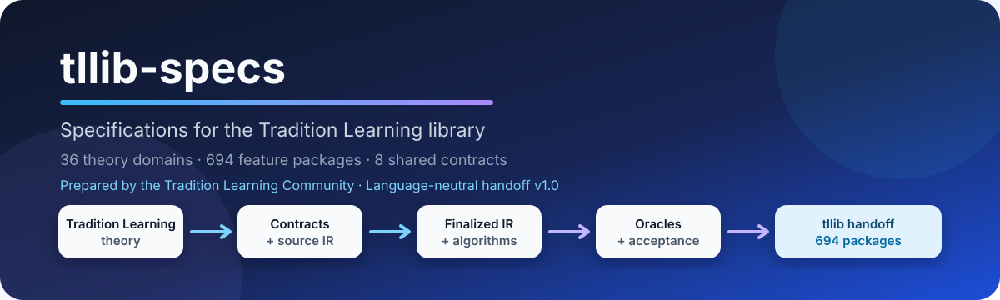

<div align="center">



# tllib-specs

**Scientific, mathematical, algorithmic, and engineering specifications for `tllib`.**

[Feature handoff](handoff/) · [Global catalog](handoff/catalog.json) · [Contributor guide](CONTRIBUTING.md) · [Repository guide](docs/REPOSITORY-GUIDE.md) · [Validation](#validation) · [Security](SECURITY.md)

</div>

## Project identity

**Tradition Learning** is a theory and research programme for learning approaches that do not depend on big-data training regimes.

**Tradition Learning Community (TLC)** is the community of scientists, mathematicians, algorithm designers, engineers, programmers, reviewers, and other contributors who study, formalize, promote, and implement that theory. TLC is an organization of people; it is not the name of the theory and it is not one of the theory's mathematical objects.

**`tllib`** is the principal software product prepared from these specifications: a scientific library intended for use in artificial intelligence as a complement to machine learning, deep learning, reinforcement learning, and related methods. Its intended role is comparable to that of a reusable AI library such as TensorFlow or PyTorch, while exposing concepts and capabilities specific to Tradition Learning.

**`tllib-specs`** is the upstream specification repository where scientists, mathematicians, algorithm designers, and specification engineers define `tllib` before runtime implementation. It transforms the theory into traceable, testable, language-neutral Feature Handoff Packages.

> The **Community** domain under `maths/02-community/community.md` is Domain 02 of the 36 Tradition Learning domains. It must not be confused with the Tradition Learning Community organization.

## Production status

`tllib-specs` contains the complete specification model, validation, traceability, and language-neutral handoff packages for the 36-domain Tradition Learning corpus. It does not contain the downstream runtime library.

| Published artifact | Finalized population |
|---|---:|
| Domain catalogs | **36** |
| Feature Handoff Packages | **694** |
| Shared structural contracts | **8** |
| Standalone exports validated by CI | **694** |
| Runtime implementations in this repository | **0** |

Feature Handoff Package v1.0 is structurally finalized. The published model is independent of C++, Rust, Ruby, Python, or any other implementation language. Production runtime code, bindings, solvers, kernels, binary packages, and release archives belong in downstream implementation repositories.

## How the repositories relate

```text
Tradition Learning theory
        ↓
Tradition Learning Community
  research · formalization · review · implementation
        ↓
tllib-specs
  scientific and engineering specification
        ↓
Feature Handoff Packages
        ↓
tllib
  downstream runtime library for AI systems
```

The repository boundary is intentional:

- this repository defines what `tllib` must mean and how conformity is tested;
- downstream runtime repositories decide concrete languages, APIs, memory models, build systems, packaging, and optimization strategies;
- unresolved scientific semantics remain unresolved until reviewed by the proper scientific authority.

## Choose your path

### Scientist or domain expert

Start with the authoritative text under [`maths/`](maths/), then identify the affected feature IDs and scientific review records. Clarify meaning, evidence, unresolved questions, and scientific authority without introducing software defaults.

### Mathematician

Start with [`registry/math-contracts/`](registry/math-contracts/) and the referenced scientific source. Work on definitions, assumptions, domains, invariants, proof obligations, and formal consistency. Missing mathematical semantics remain explicit.

### Algorithm designer

Start with [`registry/algorithms/`](registry/algorithms/), the finalized IR, and the corresponding oracle. Distinguish observable behavior, required partial order, and internal strategy. An upstream step list is not automatically a mandatory total runtime sequence.

### Specification engineer

Work across `registry/`, `handoff/`, schemas, catalogs, reports, and validators. Preserve identity, provenance, unresolved semantics, deterministic outputs, and language neutrality. Shared representation does not establish scientific equivalence.

### Runtime implementer

Start from a resolved standalone bundle exported from [`handoff/`](handoff/). Ordinary implementation should not require interpretation of the mathematical sources or intermediate pipeline. Report handoff ambiguities with the feature ID and bundle fingerprint.

### Reviewer or auditor

Review scientific integrity, structural correctness, implementation neutrality, and verifiability as separate dimensions. Use the committed reports and deterministic fingerprints as evidence.

Detailed role boundaries and workflows are in [`CONTRIBUTING.md`](CONTRIBUTING.md) and the [`Repository operating guide`](docs/REPOSITORY-GUIDE.md).

## Repository architecture

```text
maths/                         authoritative Tradition Learning source texts
registry/                      compiler-like intermediate specification pipeline
  math-contracts/              mathematical contracts
  ir/                          source intermediate representations
  test-plans/                  source test plans
  optimized-ir/                finalized engineering-facing IR
  algorithms/                  authoritative algorithm specifications
  oracles/                     acceptance oracles
  domain-finalization/         domain decisions and inventories
  global-finalization/         integrated upstream model
handoff/                       final language-neutral programmer interface
  schemas/                     JSON Schemas
  shared/                      eight shared structural contracts
  domains/                     36 complete catalogs
  features/                    694 autonomous feature packages
  catalog.json                 deterministic global catalog
reports/handoff/               domain and global audit evidence
tools/handoff/                 official validation, catalog, and export tools
docs/                          contributor operations and decision records
```

The repository functions as a controlled transformation system:

```text
Tradition Learning scientific authority
    → mathematical contracts
    → source IR
    → finalized engineering IR
    → algorithm specifications
    → acceptance oracles
    → Feature Handoff Packages
    → standalone implementation bundles
    → downstream tllib implementation
```

`registry/` is the auditable intermediate pipeline. `handoff/` is the published programmer-facing result.

## Where downstream programmers start

A resolved standalone bundle contains exactly:

```text
feature/
shared/
bundle-lock.json
```

The feature package states observable behavior, valid inputs, required outputs, invariants, errors, forbidden behavior, acceptance tests, traceability, and implementation freedoms. `shared/` contains the exact versioned structural dependencies needed by the feature. `bundle-lock.json` fixes versions, paths, and SHA-256 fingerprints without volatile timestamps.

Create or inspect one bundle:

```bash
python tools/handoff/export_bundle.py TLC-FC-00-MASTER-005 --check
python tools/handoff/export_bundle.py TLC-FC-00-MASTER-005 ./bundle
```

Exports do not copy scientific source texts, registry artifacts, intermediate IRs, or generated archives.

## Feature package contract

Every feature directory contains:

- `README.md` — human implementer guide;
- `manifest.json` — identity, version, statuses, files, and shared dependencies;
- `contract.json` — normative observable engineering contract;
- `acceptance.json` — mandatory conformance tests;
- `traceability.json` — audit links to upstream authority;
- optional `examples.json` only when a source-backed fixture is justified.

The authority order is documented in [`handoff/README.md`](handoff/README.md). README prose and examples cannot create obligations absent from the normative structured contracts.

## Language and low-level freedom

Unless a feature contract makes a property observable, an implementation remains free to choose:

- programming language and naming;
- storage, allocation, ownership, aliasing, and layout;
- copying, movement, retention, and lifetime strategy;
- serialization representation;
- concurrency, scheduling, and error transport;
- internal architecture and algorithm decomposition.

The handoff can express low-level obligations when required, but it does not select a language-specific mechanism without observable justification.

## Scientific boundary

Structural finalization does not authorize scientific invention. A contributor or downstream implementation must not invent missing:

- equations, solvers, convergence rules, domains, or types;
- proof completion or truth values;
- thresholds, scores, rankings, metrics, or categories;
- state transitions, evaluators, providers, or causal meaning;
- relation endpoints, direction, arity, composition, or membership;
- defaults for unresolved parameters or decisions.

Opaque values remain opaque. Unresolved items remain explicit. Provider-required features remain structurally implementable without fabricating provider behavior. The global scientific-review registry preserves 147 recorded review questions, while domain-level unresolved and provider boundaries remain authoritative in their respective registries.

## Global catalog

[`handoff/catalog.json`](handoff/catalog.json) is a deterministic projection of the 36 domain catalogs, 694 feature manifests, and eight shared packages. It records:

- model and tool versions;
- authoritative domain order and populations;
- feature IDs, paths, package versions, and multidimensional statuses;
- optional example presence;
- exact shared dependencies;
- deterministic package and descriptor SHA-256 fingerprints;
- explicit deprecation and substitution fields.

The catalog contains no timestamp or other volatile normative field. CI reconstructs it and rejects any mismatch.

## Validation

The sole official handoff validation CLI is:

```bash
python tools/handoff/validate_handoff.py
```

Complete handoff validation:

```bash
python tools/handoff/generate_catalog.py --check
python tools/handoff/validate_handoff.py --self-test
python tools/handoff/export_bundle.py --all --check --verify-determinism
```

The validator checks exact populations and order, schemas, required files, feature ownership, shared dependencies, cross-file identities, traceability, errors, strategies, test uniqueness, global catalog equality, and absence of normative implementation-language code.

The permanent workflow also generates each of the 694 standalone bundles twice and compares their locks and fingerprints for determinism.

## Change workflow

Use the repository issue forms and pull request template rather than unstructured changes.

1. Choose the correct scientific, specification, handoff, validation, or documentation path.
2. Identify affected domains, feature IDs, and authority.
3. Preserve unresolved science explicitly.
4. Update all affected layers or state why they are unaffected.
5. Run the relevant validation.
6. Open a focused pull request with compatibility and reviewer guidance.
7. Merge only after required checks and reviews succeed.

Cross-domain or difficult-to-reverse decisions should use a record based on [`docs/decisions/0000-template.md`](docs/decisions/0000-template.md).

## Contradictions and unresolved items

When two authoritative artifacts appear contradictory:

1. stop the affected finalization or implementation path;
2. identify the exact feature ID, operation, files, and conflicting obligations;
3. preserve current scientific and execution statuses;
4. report a minimal reproducer or conflicting acceptance case;
5. request scientific or specification adjudication;
6. do not choose the most convenient meaning.

An unresolved item is a preserved boundary, not an invitation to create an implementation default.

## Domains

The repository defines 36 domains of the **Tradition Learning theory**. The domain named **Community** is a theoretical domain and is distinct from the Tradition Learning Community organization.

| # | Domain | Features |
|---:|---|---:|
| 00 | Master | 16 |
| 01 | Disciple | 10 |
| 02 | Community | 8 |
| 03 | Huit Dimensions | 11 |
| 04 | Invariants | 10 |
| 05 | Dynamics | 7 |
| 06 | Theorems | 9 |
| 07 | Message | 6 |
| 08 | Principle | 10 |
| 09 | Values | 14 |
| 10 | Virtues | 10 |
| 11 | Capacities | 15 |
| 12 | Competencies | 13 |
| 13 | Practice | 10 |
| 14 | Lived Experience | 12 |
| 15 | Relations | 5 |
| 16 | Cohort | 17 |
| 17 | Cascade Transmission | 64 |
| 18 | Evaluation | 20 |
| 19 | Regulation | 20 |
| 20 | Robustness | 35 |
| 21 | Fairness | 18 |
| 22 | Temporality | 9 |
| 23 | Memory | 10 |
| 24 | Context | 12 |
| 25 | Culture | 8 |
| 26 | Identity | 13 |
| 27 | Reflexivity | 9 |
| 28 | Finality and Evolutionary Teleology | 22 |
| 29 | Generational Propagation | 28 |
| 30 | Expansion | 29 |
| 31 | Institutionalization | 37 |
| 32 | Drift and Correction | 18 |
| 33 | Low Data Architecture | 32 |
| 34 | Transmission Lifecycle | 109 |
| 35 | Fidelity to Invariant Core | 18 |
|  | **Total** | **694** |

The scientific source index is maintained in [`maths/README.md`](maths/README.md); the machine-readable production population is authoritative in [`handoff/catalog.json`](handoff/catalog.json).

## Governance and support

- [`CONTRIBUTING.md`](CONTRIBUTING.md) — role-based contribution and review standard;
- [`docs/REPOSITORY-GUIDE.md`](docs/REPOSITORY-GUIDE.md) — operating model, decision ownership, change levels, and definitions of ready and done;
- [`SUPPORT.md`](SUPPORT.md) — correct pathway for scientific, specification, handoff, and tooling questions;
- [`SECURITY.md`](SECURITY.md) — sensitive integrity and validator disclosures;
- [`docs/decisions/`](docs/decisions/) — durable records for cross-domain or difficult-to-reverse choices.

## Audit evidence

Global evidence is maintained under [`reports/`](reports/), including handoff validation, domain finalization, global structural finalization, dependency analysis, reconciliation records, deterministic export evidence, and implementation-readiness reports.

## Repository boundary

Changes are acceptable only when they preserve scientific identity, traceability, unresolved semantics, exact populations, deterministic validation, and language neutrality. Runtime implementation belongs in a separate downstream repository for `tllib`.
